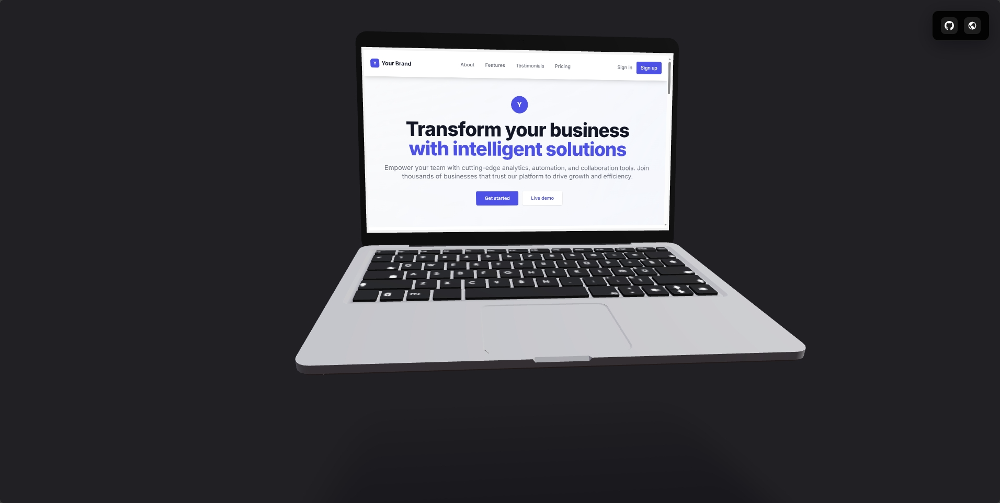

# 3D Interactive Laptop Demo

An interactive 3D floating laptop model with a usable website interface and shadow effects. Built with React and Three.js - drag to rotate the laptop and explore a full landing page rendered directly on the 3D screen.

## What's Cool About It

- 🖥️ **3D laptop** - floats and moves realistically
- 🌐 **Real website** - displayed on the laptop screen with interactive UI components
- 📱 **Readable text** - everything's sized for the 3D view
- 🎯 **Drag to rotate** - spin the laptop around in 3D space with shadow effects
- 📄 **Scrollable content** - the website scrolls inside the screen bounds

## Tech Stack

- **Frontend**: React 18, Vite
- **3D Graphics**: Three.js, @react-three/fiber, @react-three/drei
- **Styling**: Tailwind CSS (CDN) + Custom CSS for 3D content

## Setup

See [SETUP.md](SETUP.md) for development setup and technical details.

## License

See [LICENSE](LICENSE) file for license and attribution details.
